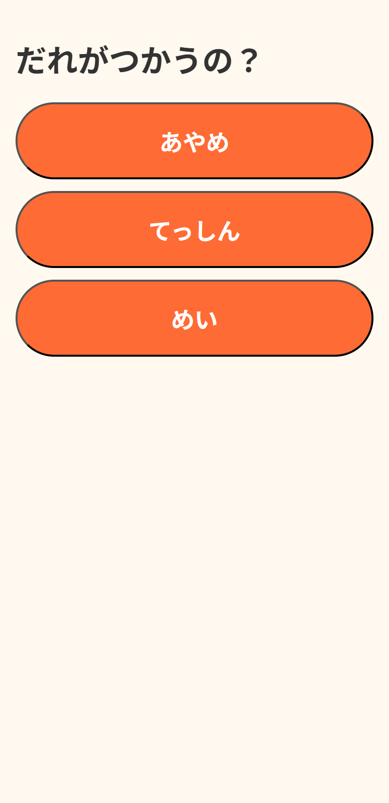
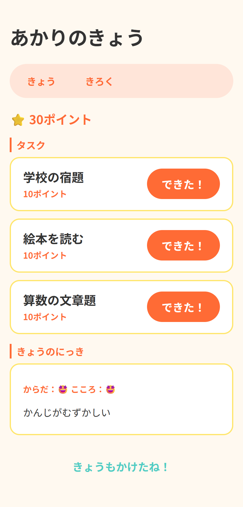
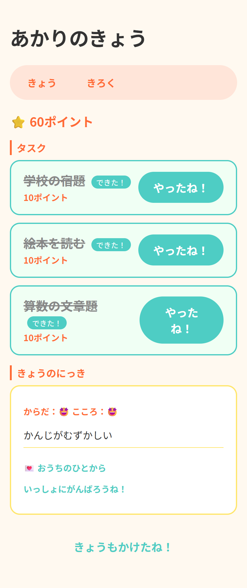
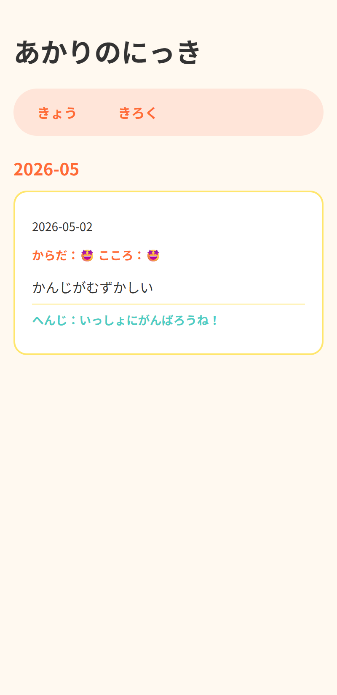
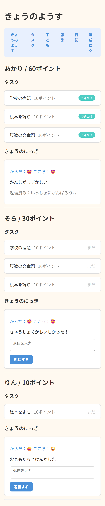
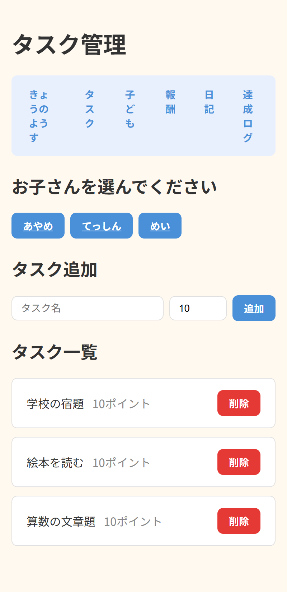
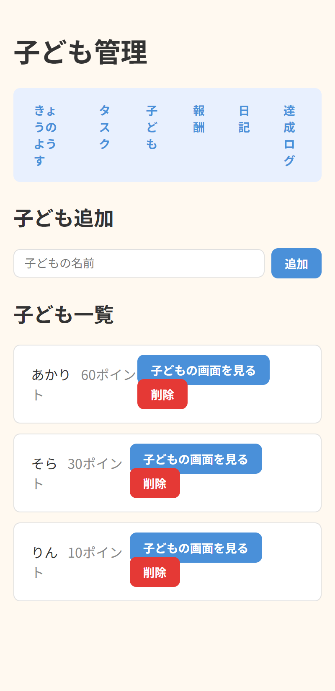

# 🌟 できたすく

毎日の頑張りを家族の宝物に変える、タスク管理＆親子日記アプリ
---

## デモ

🌟 **https://ayako-k.com/dekitasuku/**

| 画面 | アクセス方法 |
|---|---|
| 子ども画面 | トップページから子どもを選択 |
| 管理画面 | https://ayako-k.com/dekitasuku/admin.php<br>パスワード：admin1234 |
---
## ドキュメント

- [要件定義書](docs/requirements.md)
- [画面設計書](docs/screen_design.md)
- [ER図（データベース設計）](docs/er_diagram.md)

---

## 開発背景

毎日の小さな「できた！」を積み重ね、家族の宝物に。そんな願いから、できたすくを開発しました。

タスク達成でポイントが貯まるゲーム性と、日記を通じた非同期コミュニケーション機能を組み合わせることで、子どもの自己肯定感と家族の絆を育むことを目指しています。

---

## 主な機能

### 子ども側
- **タスク管理**：「宿題」「歯みがき」などのタスクを表示。「できた！」ボタンで達成記録
- **ポイント制**：タスク達成でポイント獲得。累計ポイントを常に表示
- **1日1回制限**：同じタスクを同日に重複達成できない仕組み
- **きょうのにっき**：体調（😢😕😊😄🤩）と心の調子を5段階で選択、自由記述も可能
- **返信表示**：親からの返信を「きょう」と「きろく」の両方で確認可能
- **きろく（月別日記一覧）**：過去の日記を月ごとに振り返り

### 親側（管理画面）
- **今日の様子**：全員分の今日のタスク・日記を一覧表示、その場で返信可能
- **タスク管理**：子どもごとにタスクを登録・編集・削除
- **子ども管理**：名前・累計ポイントの編集
- **日記一覧**：全期間の日記を確認・削除
- **ログ確認**：タスク達成履歴・ポイント履歴を参照

---
## 画面一覧

### 子ども選択画面


### きょう（タスク達成前）


### きょう（タスク達成後・返信表示）


### きろく（月別日記一覧）


### 管理画面：今日の様子


### 管理画面：タスク管理


### 管理画面：子ども管理


---

## 技術スタック

| 項目 | 技術 |
|---|---|
| フロントエンド | HTML / CSS / JavaScript |
| バックエンド | PHP 8.2 |
| データベース | MySQL（MariaDB） |
| 開発環境 | Docker / Docker Compose |
| 本番環境 | Xserver |

---

## セキュリティ対策

| 対策 | 実装内容 |
|---|---|
| パスワード管理 | `.env` ファイルで管理、`.gitignore` で除外 |
| SQLインジェクション対策 | PDOプリペアドステートメント |
| XSS対策 | `htmlspecialchars()` による出力エスケープ（h関数として共通化） |
| セッション管理 | `session_start()` + `$_SESSION` でログイン状態を保持 |
| 認証ガード | 全ページでセッション確認、未ログインはリダイレクト |
| 論理削除 | `deleted_at` カラムでデータ復元可能な設計 |

---
## DB設計
children        子ども管理（名前・累計ポイント）
tasks           タスクマスタ（タイトル・ポイント・子どもID）
task_logs       タスク達成記録（1日1回制限の核心テーブル）
diaries         日記（体調・心の調子・本文・日付）
diary_replies   日記への返信
rewards         ご褒美マスタ
reward_logs     ご褒美交換履歴

全テーブルに `deleted_at` カラムを実装し、**論理削除**による履歴保持を実現しています。

`task_logs` の `completed_date` に `CURDATE()` を使用することで、同一タスクの同日重複達成を防止しています。

---

## 開発のこだわりポイント

### 1. DRY原則の実践
共通処理を徹底的に分離：
- **functions.php**：XSS対策のh()関数、.env読み込み処理
- **admin_nav.php / child_nav.php**：ナビゲーション共通化
- **admin_auth.php**：セッションチェック共通化
- **header.php / footer.php**：HTML構造の共通化

### 2. トランザクション処理
タスク達成時に以下を1つのトランザクションで実行：
```php
BEGIN TRANSACTION
  INSERT INTO task_logs  // 達成記録
  UPDATE children SET total_points = total_points + ?  // ポイント加算
COMMIT
```

### 3. .envによる環境変数管理
ローカル（Docker）と本番（Xserver）で異なるDB接続情報を `.env` で管理。Xserverでは `$_ENV` が使えないため、`functions.php` で手動読み込み処理を実装しました。

### 4. 子ども目線のUI/UX
- 顔アイコン（😢😕😊😄🤩）による直感的な体調選択
- JavaScriptでクリック時にselectedクラスを切り替え
- hidden inputに値をセットしてサーバーへ送信
- カラフルな配色（オレンジ・ターコイズ・黄色）で楽しさを演出

### 5. 非同期コミュニケーション設計
親が忙しい時間でも返信を書き置きできる仕組み。子どもは「きょう」「きろく」の両方で返信を確認できます。

---
## ローカル環境構築

### デモ環境で試す場合

**https://ayako-k.com/dekitasuku/** で公開中です。環境構築なしですぐ試せます。

---

### ローカル環境を構築する場合

> ⚠️ 事前に [Docker Desktop](https://www.docker.com/products/docker-desktop/) をインストールして起動しておいてください。

**① リポジトリをクローンする**

クローンしたいフォルダに移動してから実行してください。  
（実行するとカレントフォルダに `dekitasuku` フォルダが自動作成されます）

```bash
git clone https://github.com/aya-k-o/dekitasuku.git
cd dekitasuku
```

> 💡 Windowsでデスクトップに作りたい場合は先に `cd C:\Users\ユーザー名\OneDrive\Desktop` で移動してください。

**② .envファイルを作成する**

```bash
copy .env.example .env    # Windows
cp .env.example .env      # Mac / Linux
```

作成された `.env` の中身はそのままでOKです（デフォルト値で動作します）。

**③ Dockerを起動する**

```bash
docker-compose up -d
```

3つのコンテナが `✔` になれば起動成功です。

**④ ブラウザで確認する**

- アプリ：http://localhost:8080
- phpMyAdmin：http://localhost:8081（ユーザー名：`dekitasuku_user` / パスワード：`dekitasuku_pass`）

> 💡 初回起動時に `docker/mysql/init.sql` が自動実行され、テーブルとサンプルデータが作成されます。

---
