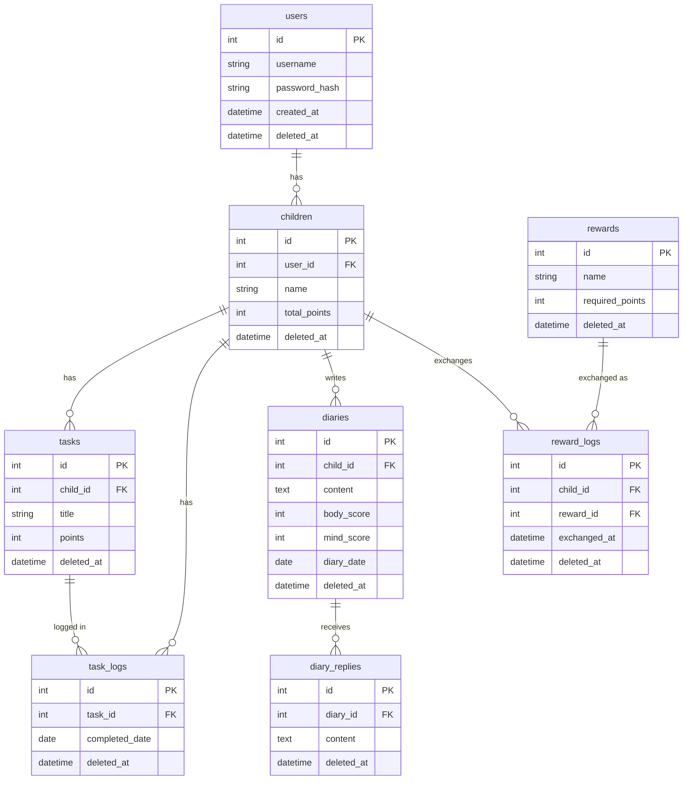

# ER図（データベース設計）

## テーブル構成



## 設計のポイント

### 1. マルチテナント設計
`users`テーブルで家族単位のアカウントを管理。`children`テーブルに`user_id`を持たせることで、複数家族が同じアプリを安全に使用できます。

認可チェックにより、URL直打ちによる他の家族のデータへのアクセスを防止しています。

```sql
-- 自分の家族の子どもだけ取得
SELECT id, name FROM children 
WHERE deleted_at IS NULL AND user_id = ?
```

### 2. 論理削除の採用
全テーブルに `deleted_at` カラムを実装。データを物理的に削除せず、履歴を保持することで：
- 誤削除からの復元が可能
- 過去のデータ分析が可能
- 子どもの成長記録を永続的に保存

### 3. 1対多の関係
中間テーブルを使わず、直接外部キーで関連付け：
- `users` ← `children`（1アカウントが複数の子どもを持つ）
- `children` ← `tasks`（1人の子が複数のタスクを持つ）
- `children` ← `diaries`（1人の子が複数の日記を書く）
- `tasks` ← `task_logs`（1つのタスクが複数回達成される）
- `diaries` ← `diary_replies`（1つの日記に複数の返信）

### 4. 1日1回制限の実現
`task_logs` テーブルの `completed_date` カラムに日付を記録。
```sql
SELECT * FROM task_logs 
WHERE task_id = ? AND completed_date = CURDATE()
```
で同日の重複達成をチェック。

### 5. ポイント管理
- `children.total_points`：累計ポイントを保持
- タスク達成時にトランザクションで更新：
```sql
BEGIN TRANSACTION
  INSERT INTO task_logs (task_id, completed_date) VALUES (?, CURDATE());
  UPDATE children SET total_points = total_points + ? WHERE id = ?;
COMMIT
```

### 6. 外部キー制約
- `ON DELETE CASCADE`ではなく、論理削除で対応
- 参照整合性を保ちながら履歴を保持
