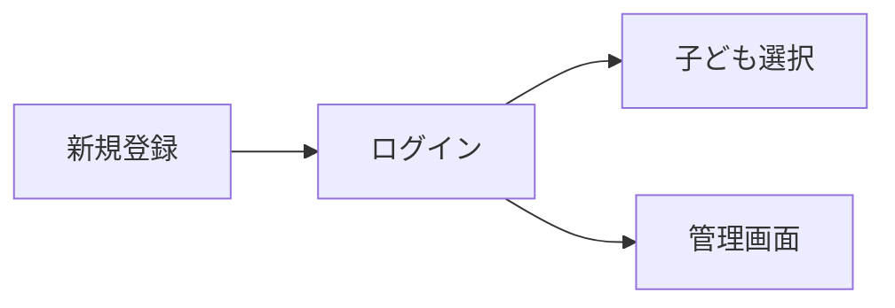
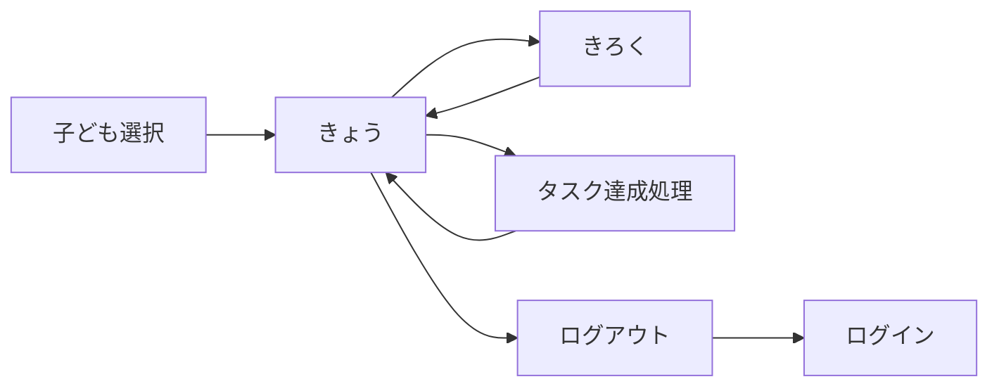
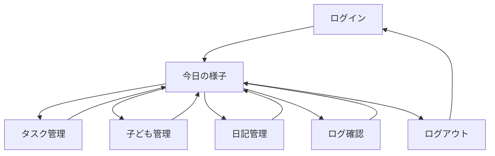

# 画面設計書

## 画面一覧

| 画面名 | ファイル名 | 説明 |
|---|---|---|
| 新規登録 | register.php | ユーザー登録画面 |
| ログイン | login.php | ユーザーログイン画面 |
| 子ども選択 | index.php | 利用する子どもを選択 |
| きょう | today.php | 今日のタスクと日記 |
| きろく | diary_list.php | 月別の日記一覧 |
| 管理画面入口 | admin.php | ログイン済みならadmin_today.phpへリダイレクト |
| 今日の様子 | admin_today.php | 全員の今日の状況確認・返信 |
| タスク管理 | admin_tasks.php | タスクの登録・削除 |
| 子ども管理 | admin_children.php | 子どもの追加・削除 |
| 日記管理 | admin_diaries.php | 全期間の日記確認・返信 |
| ログ確認 | admin_logs.php | タスク達成履歴 |
| ログアウト | logout.php | セッション破棄してlogin.phpへリダイレクト |

---

## 画面遷移図

### 認証フロー

### 子ども側の遷移

### 親側（管理画面）の遷移

---

## 1. 新規登録画面（register.php）

### 目的
新しいユーザーアカウントを作成する

### UI要素
- タイトル：「🌟 できたすく」「新規登録」
- ユーザー名入力欄（ニックネームでOK）
- パスワード入力欄（8文字以上）
- 「登録する」ボタン
- 「ログインはこちら」リンク
- エラーメッセージ表示欄
- 成功メッセージ表示欄

### 動作
1. ユーザー名・パスワードを入力
2. バリデーション（空チェック、8文字以上）
3. `password_hash()`でパスワードをハッシュ化
4. `users`テーブルにINSERT
5. 成功メッセージを表示

### セキュリティ
- パスワードは`password_hash(PASSWORD_DEFAULT)`でハッシュ化
- ユーザー名のUNIQUE制約で重複登録を防止
- ログイン済みの場合はindex.phpへリダイレクト

---

## 2. ログイン画面（login.php）

### 目的
既存ユーザーが認証を行う

### UI要素
- タイトル：「🌟 できたすく」「ログイン」
- ユーザー名入力欄
- パスワード入力欄
- 「ログイン」ボタン
- 「新規登録はこちら」リンク
- エラーメッセージ表示欄

### 動作
1. ユーザー名・パスワードを入力
2. DBからユーザー名でレコードを検索
3. `password_verify()`でハッシュと照合
4. 成功時：`session_regenerate_id(true)`でセッションID再生成
5. `$_SESSION['user_id']`にユーザーIDを保存
6. index.phpにリダイレクト

### セキュリティ
- エラーメッセージはユーザー名・パスワードどちらが間違いか教えない
- セッション固定化攻撃対策：`session_regenerate_id(true)`
- ログイン済みの場合はindex.phpへリダイレクト

---

## 3. 子ども選択画面（index.php）

### 目的
利用する子どもを選択する

### UI要素
- タイトル：「だれがつかう？」
- 子どもボタン（ログイン中ユーザーの子どもだけ表示）
- 配色：オレンジ（#FF6B35）のカラフルなボタン

### 動作
1. 子どもボタンをクリック
2. POSTリクエストで`child_id`を送信
3. セッションに`child_id`を保存
4. today.phpにリダイレクト

### セキュリティ
- `user_auth.php`でログイン確認
- `user_id`で絞り込み、自分の家族の子どもだけ表示

---

## 4. きょう画面（today.php）

### 目的
今日のタスクと日記を1画面で表示・操作

### UI要素

#### ヘッダー
- 子どもの名前
- 累計ポイント表示

#### ナビゲーション
- 「きょう」タブ（アクティブ）
- 「きろく」タブ
- 「ログアウト」

#### タスクセクション
- タスク一覧（カード形式）
  - タスク名
  - ポイント数
  - 「できた！」ボタン（未達成）/ 「やったね！」バッジ（達成済み）

#### 日記セクション
- **未記入の場合**：
  - 体調選択（😢😕😊😄🤩）
  - 心の調子選択（😢😕😊😄🤩）
  - 自由記述欄（textarea）
  - 「かけた！」ボタン
- **記入済みの場合**：
  - 体調・心の調子の表示
  - 自由記述の内容表示
  - 親からの返信表示（ある場合）
  - 「きょうもかけたね！」メッセージ

### セキュリティ
- `user_auth.php`でログイン確認
- `user_id`で子どもの所有者確認（URL直打ち対策）
- XSS対策（h()関数）
- 1日1回制限（CURDATE()でチェック）

---

## 5. きろく画面（diary_list.php）

### 目的
過去の日記を月ごとに表示

### UI要素
- ヘッダー（子どもの名前、ポイント）
- ナビゲーション（「きょう」「きろく」「ログアウト」）
- 日記一覧（カード形式）
  - 日付
  - 体調・心の調子（アイコン）
  - 自由記述
  - 親からの返信

### セキュリティ
- `user_auth.php`でログイン確認
- `user_id`で子どもの所有者確認

---

## 6. 管理画面入口（admin.php）

### 目的
ログイン済みならadmin_today.phpへ、未ログインならlogin.phpへリダイレクト

### 動作
1. `$_SESSION['user_id']`の有無を確認
2. ログイン済み → admin_today.phpへリダイレクト
3. 未ログイン → login.phpへリダイレクト

---

## 7. 管理画面：今日の様子（admin_today.php）

### 目的
全員分の今日のタスクと日記を一覧確認、返信

### UI要素
- ヘッダー：「今日の様子」
- ナビゲーション（全管理画面共通＋ログアウト）
- 子どもカード（ログイン中ユーザーの子どもだけ表示）
  - 子どもの名前
  - 今日のタスク達成状況
  - 今日の日記（体調・心の調子・内容）
  - 返信入力欄
  - 「返信する」ボタン

### セキュリティ
- `admin_auth.php`でログイン確認
- `user_id`で絞り込み、自分の家族のデータだけ表示

---

## 8. 管理画面：タスク管理（admin_tasks.php）

### 目的
タスクの登録・削除

### UI要素
- 子ども選択ボタン
- タスク追加フォーム（タスク名・ポイント）
- タスク一覧（カード形式）
  - タスク名・ポイント
  - 「削除」ボタン

### セキュリティ
- `admin_auth.php`でログイン確認
- 削除時に`user_id`で所有者確認（他の家族のタスクを削除できない）

---

## 9. 管理画面：子ども管理（admin_children.php）

### 目的
子どもの追加・削除

### UI要素
- 子ども追加フォーム（名前入力）
- 子ども一覧（カード形式）
  - 名前・累計ポイント
  - 「削除」ボタン

### セキュリティ
- `admin_auth.php`でログイン確認
- 追加時に`user_id`を紐づけ
- 削除時に`user_id`で所有者確認

---

## 10. 管理画面：日記管理（admin_diaries.php）

### 目的
全期間の日記確認・返信

### UI要素
- 日記一覧（カード形式）
  - 日付・子ども名
  - 体調・心の調子
  - 内容・返信

### セキュリティ
- `admin_auth.php`でログイン確認
- JOINで`user_id`を確認、自分の家族の日記だけ表示

---

## 11. 管理画面：ログ確認（admin_logs.php）

### 目的
タスク達成履歴の確認

### UI要素
- ログ一覧（カード形式）
  - 日付・子ども名・タスク名・ポイント

### セキュリティ
- `admin_auth.php`でログイン確認
- JOINで`user_id`を確認、自分の家族のログだけ表示

---

## デザインガイドライン

### カラーパレット
- **メインカラー**：#FF6B35（オレンジ）
- **サブカラー**：#4ECDC4（ターコイズ）
- **アクセント**：#FFE66D（黄色）
- **背景**：#FFF9F0（クリーム）
- **管理画面**：#4A90D9（青）

### フォント
- 子ども向け：丸ゴシック系
- 管理画面：標準的なゴシック体

### UI原則
- 子ども画面：大きなボタン、わかりやすいアイコン
- 管理画面：情報密度高め、テーブル形式
- モバイルファースト設計
