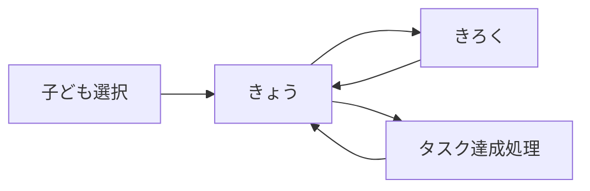
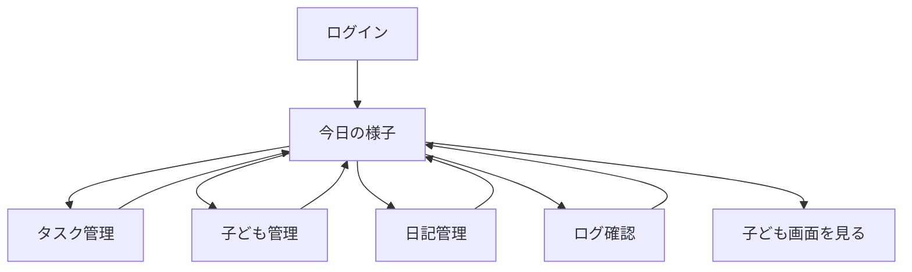

# 画面設計書

## 画面一覧

| 画面名 | ファイル名 | 説明 |
|---|---|---|
| 子ども選択 | index.php | 利用する子どもを選択 |
| きょう | today.php | 今日のタスクと日記 |
| きろく | diary_list.php | 月別の日記一覧 |
| 管理画面ログイン | admin.php | 親用ログイン画面 |
| 今日の様子 | admin_today.php | 全員の今日の状況確認・返信 |
| タスク管理 | admin_tasks.php | タスクの登録・編集・削除 |
| 子ども管理 | admin_children.php | 子どもの名前・ポイント管理 |
| 日記管理 | admin_diaries.php | 全期間の日記確認・削除 |
| ログ確認 | admin_logs.php | タスク達成履歴・ポイント履歴 |

---

## 画面遷移図

### 子ども側の遷移

### 親側（管理画面）の遷移

---

## 1. 子ども選択画面（index.php）

### 目的
利用する子どもを選択する

### UI要素
- タイトル：「だれがつかう？」
- 子どもボタン（複数）：各子どもの名前を表示
- 配色：オレンジ（#FF6B35）のカラフルなボタン

### 動作
1. 子どもボタンをクリック
2. POSTリクエストで`child_id`を送信
3. セッションに`child_id`を保存
4. today.phpにリダイレクト

### セキュリティ
- セッション開始
- `child_id`の型チェック（整数型）

---

## 2. きょう画面（today.php）

### 目的
今日のタスクと日記を1画面で表示・操作

### UI要素

#### ヘッダー
- 子どもの名前
- 累計ポイント表示

#### ナビゲーション
- 「きょう」タブ（アクティブ）
- 「きろく」タブ

#### タスクセクション
- タスク一覧（カード形式）
  - タスク名
  - ポイント数
  - 「できた！」ボタン（未達成）/ 「やったね！」バッジ（達成済み）

#### 日記セクション
- **未記入の場合**：
  - 体調選択（😢😕😊😄🤩）
  - 心の調子選択（😢😕😊😄🤩）
  - 自由記述欄（textarea）
  - 「かけた！」ボタン
- **記入済みの場合**：
  - 体調・心の調子の表示
  - 自由記述の内容表示
  - 親からの返信表示（ある場合）
  - 「きょうもかけたね！」メッセージ

### 動作

#### タスク達成
1. 「できた！」ボタンをクリック
2. complete.phpにPOSTリクエスト
3. トランザクション処理：
   - task_logsにINSERT
   - childrenのポイントUPDATE
4. today.phpにリダイレクト

#### 日記記入
1. 体調・心の調子を選択（JavaScriptでクラス切り替え）
2. 自由記述を入力
3. 「かけた！」ボタンをクリック
4. diariesテーブルにINSERT
5. ページリロード

### セキュリティ
- セッション確認（未ログインはindex.phpへ）
- XSS対策（h()関数）
- 1日1回制限（CURDATE()でチェック）

---

## 3. きろく画面（diary_list.php）

### 目的
過去の日記を月ごとに表示

### UI要素
- ヘッダー（子どもの名前、ポイント）
- ナビゲーション（「きょう」「きろく」）
- 月選択（現在は手動でURLパラメータ変更）
- 日記一覧（カード形式）
  - 日付
  - 体調・心の調子（アイコン）
  - 自由記述
  - 親からの返信

### 動作
1. デフォルトで今月の日記を表示
2. カード形式で日付降順に表示
3. 返信がある場合は「💌 おうちのひとから」として表示

---

## 4. 管理画面：ログイン（admin.php）

### 目的
親用の認証

### UI要素
- タイトル：「管理画面」
- パスワード入力欄
- 「ログイン」ボタン

### 動作
1. パスワード入力
2. `.env`のADMIN_PASSと照合
3. 一致すればセッションに認証フラグを保存
4. admin_today.phpにリダイレクト

### セキュリティ
- パスワードは`.env`で管理
- セッション固定攻撃対策（session_regenerate_id()）

---

## 5. 管理画面：今日の様子（admin_today.php）

### 目的
全員分の今日のタスクと日記を一覧確認、返信

### UI要素
- ヘッダー：「今日の様子」
- ナビゲーション（全管理画面共通）
- 子どもカード（複数）
  - 子どもの名前
  - 今日のタスク達成状況
  - 今日の日記（体調・心の調子・内容）
  - 返信入力欄
  - 「返信する」ボタン
  - 「🔍 画面を見る」ボタン

### 動作

#### 返信
1. 返信を入力
2. 「返信する」ボタンをクリック
3. diary_repliesテーブルにINSERT
4. ページリロード

#### 子ども画面を見る
1. 「🔍 画面を見る」ボタンをクリック
2. today.php?child_id=Xにリダイレクト
3. GETパラメータでセッション更新

---

## 6. 管理画面：タスク管理（admin_tasks.php）

### 目的
タスクの登録・編集・削除

### UI要素
- タスク追加フォーム
  - 子ども選択（セレクトボックス）
  - タスク名入力
  - ポイント入力
  - 「追加」ボタン
- タスク一覧（テーブル形式）
  - 子ども名
  - タスク名
  - ポイント
  - 「編集」ボタン
  - 「削除」ボタン

### 動作
- 追加：tasksテーブルにINSERT
- 編集：UPDATE処理
- 削除：deleted_atにタイムスタンプをセット（論理削除）

---

## 7. 管理画面：子ども管理（admin_children.php）

### 目的
子どもの名前・ポイント管理

### UI要素
- 子ども追加フォーム
  - 名前入力
  - 「追加」ボタン
- 子ども一覧（テーブル形式）
  - 名前
  - 累計ポイント
  - 「編集」ボタン
  - 「削除」ボタン

### 動作
- 追加：childrenテーブルにINSERT
- 編集：UPDATE処理
- 削除：deleted_atにタイムスタンプをセット（論理削除）

---

## 8. 管理画面：日記管理（admin_diaries.php）

### 目的
全期間の日記確認・削除

### UI要素
- 日記一覧（テーブル形式）
  - 日付
  - 子ども名
  - 体調・心の調子
  - 内容
  - 返信
  - 「削除」ボタン

### 動作
- 削除：deleted_atにタイムスタンプをセット（論理削除）

---

## 9. 管理画面：ログ確認（admin_logs.php）

### 目的
タスク達成履歴・ポイント履歴の確認

### UI要素
- タブ切り替え（タスクログ / ご褒美ログ）
- ログ一覧（テーブル形式）
  - 日時
  - 子ども名
  - タスク名 / ご褒美名
  - ポイント

### 動作
- 読み取り専用（削除・編集機能なし）

---

## デザインガイドライン

### カラーパレット
- **メインカラー**：#FF6B35（オレンジ）
- **サブカラー**：#4ECDC4（ターコイズ）
- **アクセント**：#FFE66D（黄色）
- **背景**：#FFF9F0（クリーム）
- **管理画面**：#4A90D9（青）

### フォント
- 子ども向け：丸ゴシック系
- 管理画面：標準的なゴシック体

### UI原則
- 子ども画面：大きなボタン、わかりやすいアイコン
- 管理画面：情報密度高め、テーブル形式
- モバイルファースト設計